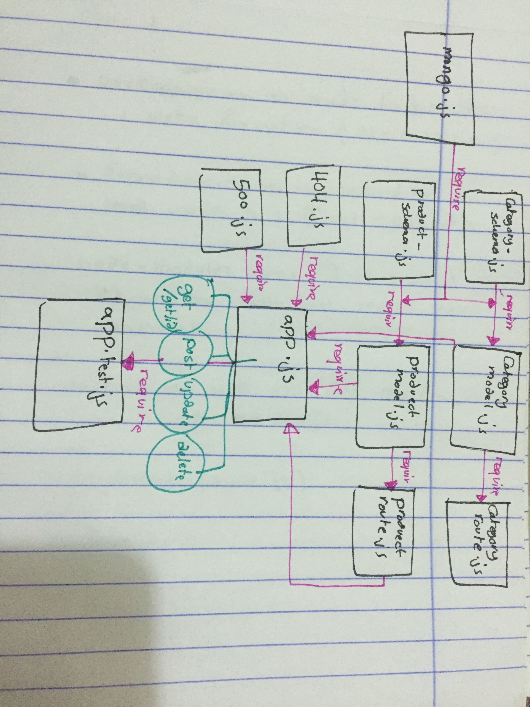

# lab-08-expressRouting-connectingApi

## Author: As'har Oran
## Links and Resources
* PR : [https://github.com/asharoran-401-advanced-javascript/lab-08-expressRouting-connectingApi/pull/1]
* ci/cd : [https://github.com/asharoran-401-advanced-javascript/lab-08-expressRouting-connectingApi/actions]
##  Setup
- install jest eslint mongo mongoose supergoose express dotenv cors

## PORT - 3000

## MONGODB_URI - URL to the run mongo (lab-5)DB
## How to initialize/run your application (where applicable)
npm run test
npm test 
## UML
image : 